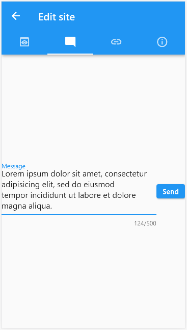
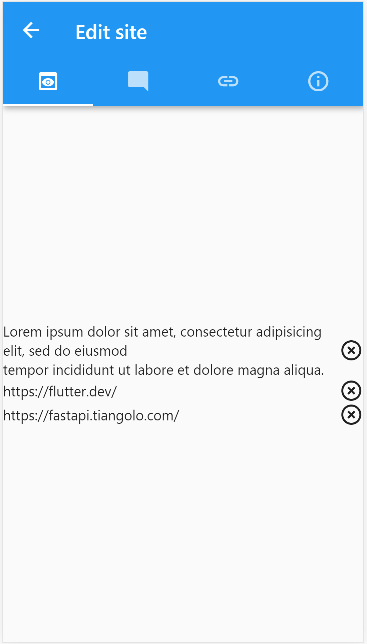
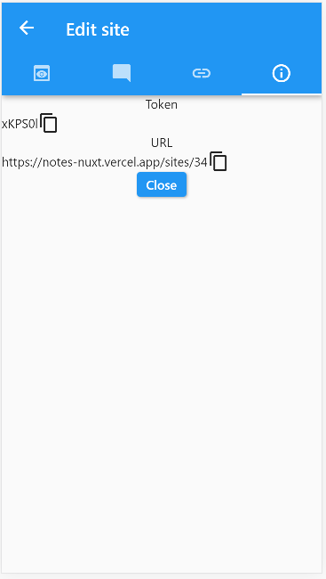

# notes_flutter

Flutter client for note/link sharing site. Requires backend to work.

Backend: https://github.com/thenriks/notes-pub

## Usage

App allows users to crete lists of notes or links. Lists can be edited with token and shared with others. Token and link to shared list can be found in info screen.

In edit mode elements can be added or removed if site is not closed. Site can be closed in info screen.
